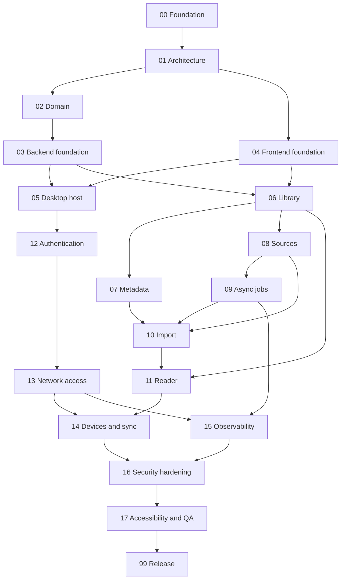

# Roadmap

Nineteen phases, ordered by dependency rather than by excitement. Each one has
its own directory with an objective, scope, risks, test strategy, security
considerations, and exit criteria.

A phase closes when its exit criteria are met — not when the happy path works.

## How to read this

**Detail decreases with distance.** Phases 00–05 are specified in depth because
they are next. Phases 06 onward are outlines, and say so at the top. Writing
detailed requirements for phase 14 before the domain model exists produces
confident fiction that later gets treated as a decision.

Each outline is expanded into a full phase document when its dependencies close.

## The phases

| # | Phase | Delivers | Status |
|---|---|---|---|
| [00](00-foundation/) | Foundation | Repository, engineering memory, CI skeleton | **In progress** |
| [01](01-architecture/) | Architecture | System, frontend, backend, host, persistence and messaging design | In progress |
| [02](02-domain/) | Domain | The model: works, editions, files, sources, progress | In progress |
| [03](03-backend-foundation/) | Backend foundation | Go service skeleton, config, logging, errors, migrations, health | Not started |
| [04](04-frontend-foundation/) | Frontend foundation | React shell, design tokens, component library, routing, data layer | Not started |
| [05](05-desktop-host/) | Desktop host | Electron shell, IPC boundary, lifecycle, loopback serving | Not started |
| [06](06-library/) | Library | Browse, collections, search, filter, sort — the first real slice | Not started |
| [07](07-metadata/) | Metadata | Open Library adapter, normalisation, caching, Discover | Not started |
| [08](08-sources/) | Sources | Source abstraction, capabilities, first provider | Not started |
| [09](09-async-jobs/) | Async jobs | Background work where it is actually justified | Not started |
| [10](10-import/) | Import | Discovery → extraction → matching → confirmation → persistence | Not started |
| [11](11-reader/) | Reader | Reading, position, preferences | Not started |
| [12](12-authentication/) | Authentication | Accounts, sessions, authorisation | Not started |
| [13](13-network-access/) | Network access | LAN exposure, binding, pairing, transport security | Not started |
| [14](14-devices-and-sync/) | Devices and sync | Device management, progress across devices | Not started |
| [15](15-observability/) | Observability | Metrics, queue visibility, diagnostics, Activity | Not started |
| [16](16-security-hardening/) | Security hardening | Threat model consolidation, external-review readiness | Not started |
| [17](17-accessibility-and-qa/) | Accessibility and QA | Conformance, the full test matrix, regression suite | Not started |
| [99](99-release/) | Release | Packaging, versioning, release process, `docs`/`website` repos stood up | Not started |

## Dependency graph



## Why the order is what it is

**Authentication comes before network exposure.** This is the ordering decision
that matters most. The host binds to loopback from phase 05 and stays there
until phase 12 gives it a credential system. There is no intermediate state
where the library is reachable from another machine without a login — not even
a temporary one behind a "dev only" flag. Constitution §6.

**The domain is settled before the backend is built.** Persistence shaped by
whatever the first API endpoint needed is how a schema ends up describing the
UI instead of the subject matter. Phase 02 produces the model; phase 03
implements against it.

**Metadata, sources, and library are three phases, not one.** They are the
three boundaries the constitution refuses to merge (§3), and building them
separately is what keeps them separate. Phase 06 delivers a working library
with no external integration at all — which proves the domain stands on its
own.

**Async infrastructure arrives when async work does.** RabbitMQ is not part of
the backend foundation. Phase 09 sits immediately before import and source
synchronisation because that is the first point where background processing is
genuinely warranted. If phase 09's own analysis concludes a simpler mechanism
suffices, that is a legitimate outcome and gets recorded as an ADR.

**Reading comes after import.** A reader with nothing to read cannot be tested
against anything real, and EPUB rendering is where hostile content is most
dangerous — it deserves a real corpus of files to defend against.

## Deviations from the original plan

The master brief proposed a phase list. This one differs in six places, each
deliberately:

| Change | Reason |
|---|---|
| Authentication moved *before* network exposure | The original order would have produced a build serving an unauthenticated library to the LAN. Not acceptable even transiently. |
| Observability split: baseline into phase 03, maturity into phase 15 | Structured logging and health checks are part of writing a server, not a later project. Phase 15 covers metrics, queue depth, and diagnostics. |
| Security is a gate on every phase, not one phase | Phase 16 is consolidation and external-review readiness. A single security phase invites deferral. |
| Async jobs became its own phase, placed at first need | Avoids assuming RabbitMQ is warranted before anything needs it. |
| "Open Library" renamed to "Metadata" | A phase named after a vendor becomes a phase coupled to that vendor. |
| Accessibility and QA consolidation added as phase 17 | Per-phase accessibility work still leaves conformance testing and the cross-device matrix as real, separate work. |

## Working a phase

```
Discover → Spec → Review → Test plan → RED → Implement → GREEN
        → Refactor → QA → Security audit → Document → Close
```

Two points stop for the maintainer:

1. **After the spec review** — before any implementation begins.
2. **After the security audit** — before the phase is marked closed.

Between those, work proceeds without check-ins. An automated contributor must
not cross either gate on its own judgement.

## Status vocabulary

| Status | Means |
|---|---|
| Not started | No work has begun. |
| In progress | Specs or implementation underway. |
| Blocked | Waiting on a dependency or a decision. The phase file says which. |
| Closed | Exit criteria met, audit clear, maintainer signed off. |

"Maintainer approval recorded" (an exit criterion on every phase) means the
maintainer fills in the phase file's own **Closed** date, in the header table
at the top of the phase document — not a separate file. `reviews/` is for
specs, ADRs, and boundary-crossing changes; a phase's own closure doesn't get
a second, redundant record. If a phase closes with unresolved disagreement
worth remembering, a line under its **Why here** or a new **Closure notes**
section says so — the date alone isn't enough when the sign-off wasn't
unanimous.
